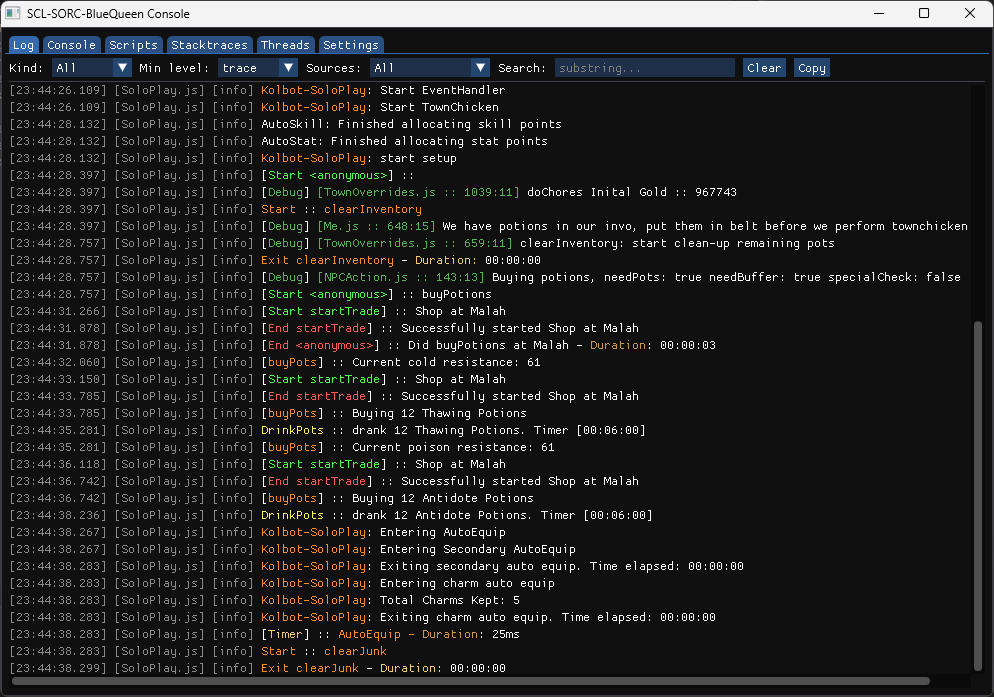
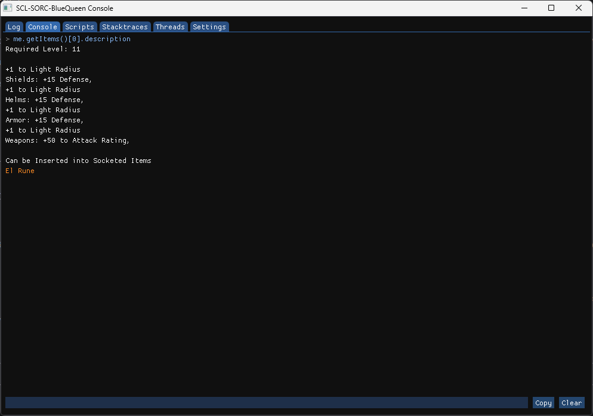
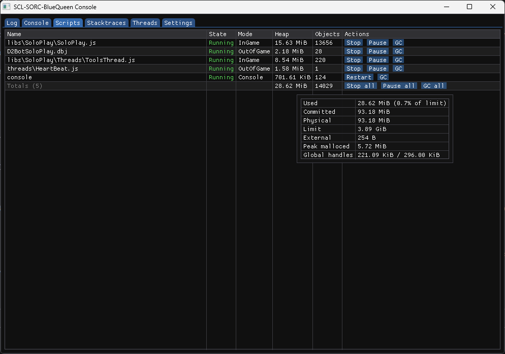
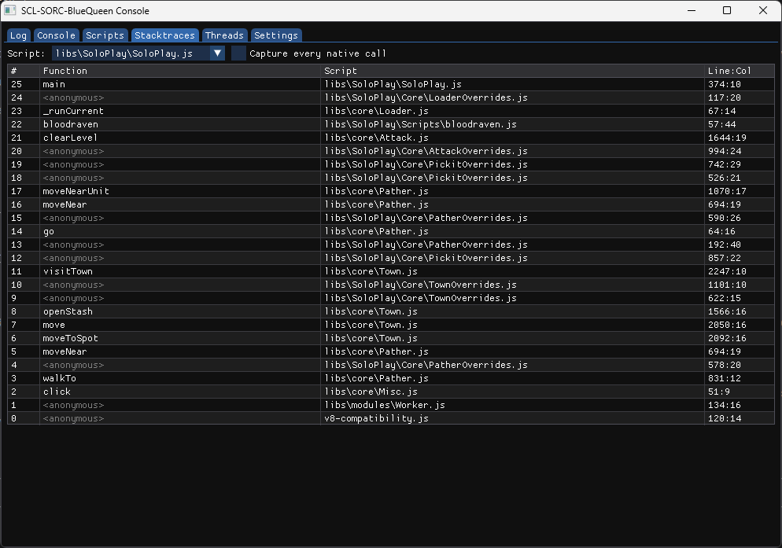
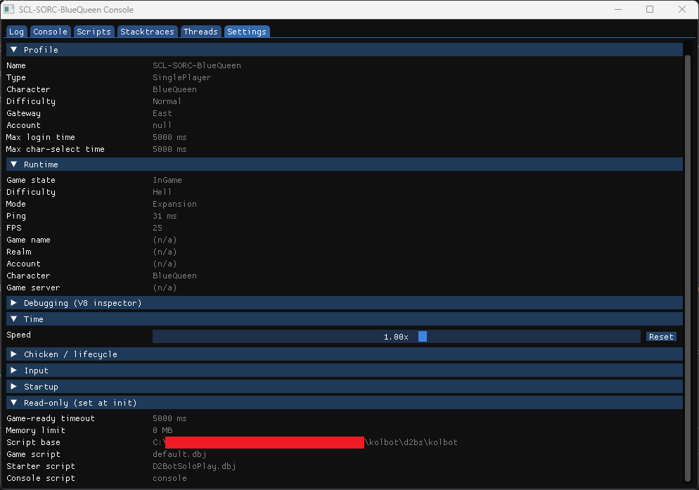

# d2bsng

> This project has been vibe coded with [Claude](https://claude.com/claude-code).

**d2bsng** (D2 Botting System: Next Generation) is a modern, from-scratch rewrite of the
long-running d2bs scripting and automation framework for Diablo II: Lord of Destruction.
Where the legacy project embedded Mozilla's SpiderMonkey JavaScript engine, d2bsng is built
on Google's V8 - the same engine that powers Chrome and Node.js - and ships as a 32-bit
Windows DLL injected into the game client (patch 1.14d).

A central design goal is **JavaScript API compatibility with the legacy d2bs project**, so
that the large existing body of community scripts written against the older SpiderMonkey-era
API can run with minimal or no changes. Scripts read live game state and drive the client
through a typed game-abstraction layer built on [D2MOO](https://github.com/ThePhrozenKeep/D2MOO),
and the runtime ships with conveniences the original never had - notably full Chrome DevTools
debugging of each running script.

> The JavaScript API and the 1.14d implementation are complete - d2bsng aims to be a drop-in
> replacement for the original d2bs. A few behaviors carry over deliberately from the original;
> see [Caveats](#caveats).

**[API reference &rarr; resurrectedtrader.github.io/d2bsng](https://resurrectedtrader.github.io/d2bsng/)** -
a browsable, versioned reference for the full script-visible API (classes, global functions,
events, the `me` object, and the Diablo II `.txt` data tables), with a per-version changelog.
TypeScript declarations (`d2bsng.d.ts`) for editor completion ship as a release asset.

## Disclaimer

This is an unofficial, fan-made tool for the 1.14d patch of a game owned by Blizzard
Entertainment. It is **not affiliated with, endorsed by, or supported by Blizzard**.
Automating an online game generally violates its Terms of Service; use at your own risk and
prefer single-player or private servers. You alone are responsible for how you use this
software.

## Background: why it exists

The original d2bs has been a fixture of the Diablo II automation community for many years,
and a substantial ecosystem of scripts has been written against its JavaScript API. That
project was built on SpiderMonkey, an engine whose embedding API and tooling have aged
considerably.

d2bsng re-implements the framework from scratch with a few goals:

- **A modern JavaScript engine.** Moving to V8 brings a current language implementation
  (modern ECMAScript, fast JIT) and a maintained, well-documented embedding API.
- **First-class debugging.** Because it is V8, each running script's isolate can be attached
  to the Chrome DevTools frontend - breakpoints, stepping, scope inspection, and a REPL
  against a live bot. See [Debugging](#debugging).
- **Compatibility with the existing script ecosystem.** The JavaScript surface is modeled on
  the legacy d2bs API, and the runtime applies a small set of compatibility shims so that
  scripts written for the SpiderMonkey-era engine keep working. See
  [Compatibility with legacy d2bs scripts](#compatibility-with-legacy-d2bs-scripts).
- **A clean game-abstraction layer.** Game memory access is isolated behind a
  version-agnostic interface, so the JavaScript API is decoupled from any single game build
  and additional versions can be supported by adding a sibling implementation. See
  [Architecture](#architecture).

## What this port adds over the original d2bs

Beyond the move from SpiderMonkey to V8, this port adds capabilities the original never had:

- **Chrome DevTools debugging.** Each script's isolate is a Chrome DevTools Protocol target -
  real breakpoints, stepping, scope inspection, and a console against a running bot. See
  [Debugging](#debugging).
- **A real dev console.** An ImGui overlay (toggle with Home, or Ctrl+Break as an escape hatch
  when the game is hung and not processing normal input) with separate panels for log output,
  an interactive REPL, per-script control (stop / pause / resume / restart) with
  live V8 heap and wrapped-object-instance diagnostics, JS stack traces, native per-thread
  stacks (via a symbol-resolving stack walker), and a live settings editor. The original had
  only a single command-line scrollback.
- **SOCKS5 proxy for the game's own traffic.** Started with
  `-proxy socks5://[user:password@]host:port`, it tunnels the client's Battle.net / realm /
  game-server connections through a SOCKS5 proxy (RFC 1928 / 1929), fail-closed.
  Script-opened sockets bypass it. This is easiest to manage through D2BotNG, whose proxy
  manager can supply the per-instance proxy setting.
- **A native HTTP/HTTPS client.** `HttpClient` provides blocking `request` / `get` / `post` /
  `put` / `delete` / `head` static methods backed by WinHTTP, with TLS validated against the
  Windows certificate store and automatic (WPAD) proxy detection. Each call returns a
  plain `{ status, statusText, ok, headers, url, body }` object; `body` is a UTF-8 string, or
  an `ArrayBuffer` when the request options set `binary: true`. Request options include
  `headers`, `body`, `timeout` (per-operation, default 30s), `totalTimeout` (overall
  wall-clock cap, default 120s; `0` disables), `followRedirects`, `insecure` (skip TLS
  verification - dangerous, off by default), and `maxResponseBytes`.
  Non-2xx responses are returned rather than thrown. Like script sockets, its traffic bypasses the `-proxy` SOCKS5 tunnel.
  The original left scripts to hand-roll HTTP over raw, plaintext sockets.
- **Speedhack.** Global game-time scaling, configurable via the `Speed` INI key, the
  `setSpeed()` / `getSpeed()` globals, or the console settings panel.
- **Automatic character-state reporting.** A live snapshot (identity, key stats,
  skills / quests / waypoints, all inventory containers, active weapon set) is serialized to
  JSON and pushed to the D2Bot.Next / D2BotNG manager over `WM_COPYDATA` each game tick. The
  original left all such reporting to script code.
- **A version-agnostic game-abstraction layer.** The JavaScript API talks to a typed game
  interface rather than hardcoded memory offsets, so the framework is decoupled from any
  single game build and other versions can be supported by adding a sibling implementation.

It also extends a few original behaviors, several of them around the Diablo II `.txt` data
tables:

- **`uniqueid` resolves for items.** For unique/set items it returns the file index into
  uniqueitems.txt / setitems.txt; the original returned `-1`.
- **Extra `affixes` and `properties` data tables.** The magic-affix table (magicprefix /
  magicsuffix) and properties.txt are exposed through `getBaseStat`, alongside the original
  tables.
- **Whole-row reads and a `TxtTables` namespace.** `getBaseStat(table, row)` with the column
  omitted returns the whole row as a `{column: value}` object, and a non-constructable
  `TxtTables` global exposes the data tables through static methods for listing tables and
  columns and reading rows or cells by name - so scripts can discover the schema at runtime
  instead of hardcoding indices.

## Screenshots

The in-game dev console (toggle with **Home**) replaces the original's single
command-line scrollback with separate, ImGui-rendered panels:

<table>
  <tr>
    <td width="50%"><br><sub><b>Log</b> - colorized, filterable log output</sub></td>
    <td width="50%"><br><sub><b>Console</b> - interactive JS REPL against the running bot</sub></td>
  </tr>
  <tr>
    <td width="50%"><br><sub><b>Scripts</b> - stop / pause / resume / restart, with live V8 heap and wrapped-instance counts</sub></td>
    <td width="50%"><br><sub><b>Stack traces</b> - JS stacks plus native per-thread stacks via a symbol-resolving walker</sub></td>
  </tr>
  <tr>
    <td width="50%"><br><sub><b>Settings</b> - live editor, including the speedhack time scale</sub></td>
    <td width="50%"></td>
  </tr>
</table>

(For full breakpoint/step debugging, attach Chrome DevTools - see [Debugging](#debugging).)

## Architecture

The codebase builds six targets plus a test executable. A frontend (JS) and a backend (1.14d) both compile against a shared `contract`; a thin glue project links one of each into the injectable DLL:

| Target | Source | Output | Role |
| --- | --- | --- | --- |
| `utils` | `src/utils/` | `utils.lib` | Standalone utilities (crypto, threading, stack walking) |
| `contract` | `src/contract/` | `contract.lib` | The version-agnostic game-abstraction *interface* (`game/` handle types) plus shared DTOs. The boundary both frontends and backends compile against. |
| `core` | `src/core/` | `core.lib` | Shared infrastructure: config, speedhack, proxy. Depends on `contract`. |
| `js` | `src/frontends/js/` | `js.lib` | JavaScript scripting frontend: engine + V8 JavaScript API. Depends on `contract` + `core`. |
| `lod114d` | `src/backends/lod114d/` | `lod114d.lib` | The 1.14d game *backend* (directory named for the patch it targets) - game-memory reads, function calls, hooks, offsets. Implements `contract`; depends on `contract` + `core`. No frontend dependency. |
| `d2bs` | `src/glue/js-lod114d/` | `d2bs.dll` | Glue: `DllMain` + wiring. Links js + lod114d + contract + core + utils. This is the injectable DLL. |
| `js_tests` | `tests/frontends/js/` | `js_tests.exe` | A [doctest](https://github.com/doctest/doctest) suite (pathfinding) compiled against a fake game layer |

The key structural decision is the split between a **version-agnostic game interface**
(`src/contract/game/` - thin handle types like `Unit`, `Room`, `Level`, `Party`, `Control`
declared in terms of plain C++ only) and a **1.14d implementation** (`src/backends/lod114d/`) that
provides the actual game-memory reads, function calls, hooks, and offsets. The frontend and
JavaScript API never touch game memory directly or depend on any particular game build;
supporting another game version means adding a new backend lib (sibling of `src/backends/lod114d/`)
over the same `contract` + `core`, and a new frontend (e.g. a non-JS host) is a sibling of
`src/frontends/js/`. Frontend and backend never reference each other - only the `d2bs` glue does.

The project is **32-bit (Win32) only** (required for 1.14d), compiled with C++23 using the
LLVM/Clang (ClangCL) toolchain with link-time optimization, so the thin wrapper types inline
away across translation units.

Design notes for contributors live in [`docs/`](docs/):

- [`docs/coords.md`](docs/coords.md) - the two D2 coordinate spaces (subtiles vs game coords)
  and where the conversion lives.
- [`docs/game_thread_safety.md`](docs/game_thread_safety.md) - identity-based handles,
  per-frame pointer caching, and the game read/write lock model that keeps scripts from
  blocking each other or the game thread.
- [`docs/window_message_handling.md`](docs/window_message_handling.md) - the input hook and
  game-window message handling.
- [`docs/inspector.md`](docs/inspector.md) - how each script isolate is exposed to Chrome
  DevTools.

## Prerequisites

- Windows
- Visual Studio 2022 with the **C++ Clang tools for Windows (ClangCL)** workload
- Windows SDK **10.0.26100.0**
- The 32-bit (Win32) toolchain - the project is x86-only for 1.14d compatibility
- [vcpkg](https://github.com/microsoft/vcpkg) - dependencies are restored from `vcpkg.json`
- A monolithic V8 build that you supply (see [V8](#v8))

## Getting the source

```
git clone --recurse-submodules <repo-url> d2bsng
```

[D2MOO](https://github.com/ThePhrozenKeep/D2MOO) is a git submodule under
`dependencies/D2MOO`. If you cloned without `--recurse-submodules`:

```
git submodule update --init --recursive
```

## V8

The V8 headers are vendored under `dependencies/v8/include` (**V8 14.0.264.0**), but the
prebuilt static libraries are **not** included in this repository - you must build and supply
them yourself, matching the vendored headers exactly:

- `dependencies/v8/libs/x86-release/v8_monolith.lib` (Release)
- `dependencies/v8/libs/x86-debug/v8_monolith.lib` (Debug)

Build V8 **14.0.264.0** as a monolith for `target_cpu = "x86"` with the static CRT (`/MT` for
Release, `/MTd` for Debug) so it matches the headers and this project's runtime settings. The
build must include the `v8_inspector` engine (part of a standard monolith) for the DevTools
integration. See the upstream [V8 build documentation](https://v8.dev/docs/build).

## Building

`build.ps1` (PowerShell) auto-detects Visual Studio via vswhere and can be run from any
directory. From a PowerShell prompt in the repo root:

```
.\build.ps1               # Release build (default)
.\build.ps1 Debug         # Debug build
.\build.ps1 test          # build and run the test suite
.\build.ps1 format        # clang-format all sources
.\build.ps1 check-format  # verify formatting without modifying
.\build.ps1 lint          # clang-tidy analysis (scripts/lint.ps1)
.\build.ps1 fix           # clang-tidy --fix
```

From cmd or another shell, invoke it as
`powershell -NoProfile -ExecutionPolicy Bypass -File build.ps1 <target>`. The build itself is
MSBuild over `d2bsng.slnx`, so you can also build directly with MSBuild or in Visual Studio.
Build output is written to `Release/` (or `Debug/`); the injectable DLL is `d2bs.dll`.

## Tests

```
.\build.ps1 test
Release\js_tests.exe -ltc             # list all test cases
Release\js_tests.exe -tc="Walk A*"    # run a subset by name
Release\js_tests.exe -s               # verbose (assertions + benchmarks)
```

The suite compiles the real pathfinder against fake game-layer implementations - no DLL, no
V8, and no running game required. It currently covers the pathfinding engine.

Real-game collision benchmarks run against the `.d2col` fixtures under
`tests/frontends/js/fixtures/maps/` (collision dumps included in the repo). The benchmarks
auto-discover whatever is present and skip gracefully if the folder is empty.

## Compatibility with legacy d2bs scripts

Running existing d2bs scripts on a different JavaScript engine is the project's defining
constraint, and it is handled in two layers, both applied at the point user source enters V8:

1. **Source rewrites.** Before compilation, each script is lightly preprocessed: a UTF-8 BOM
   is stripped; a legacy strict-mode opt-in is translated into a real `"use strict"`
   directive (with the script origin offset so error line numbers still line up); and a
   declaration idiom that the older engine bound to the global object - but V8 does not - is
   rewritten so cross-script lookups keep resolving.

2. **A per-context compatibility prelude.** Each V8 context is seeded with shims for
   SpiderMonkey-era behaviors that scripts relied on: aliases for non-standard string/array
   methods that later became standard under different names, a higher default stack-trace
   limit, a stack-trace formatter and `Error` properties (`fileName` / `lineNumber` /
   `columnNumber`) in the exact textual shape that legacy relative-import resolvers parse, an
   approximation of the old eval-roundtrippable `toSource()` repr that some error-logging
   paths call, and a small wrapper that guarantees a JS stack frame exists around the
   built-in delay primitive so a tight script loop can still be interrupted by `stop()`.

These shims are deliberately scoped to bridge documented engine differences, not to reproduce
bugs. They are currently always-on; the plan is to expose an API to turn these compatibility
layers off, to be used as and if the legacy scripting frameworks stop relying on them.

The aim is broad compatibility with the existing d2bs script ecosystem, not a bit-for-bit
clone. Where the legacy engine's observable behavior was relied upon, d2bsng preserves it;
where a script depended on an outright SpiderMonkey extension, the prelude provides an
equivalent.

## Debugging

Each running script's V8 isolate registers as a Chrome DevTools target, so you can point
`chrome://inspect` at a live bot and set breakpoints, step, inspect scopes, and evaluate
expressions. Pausing at a breakpoint blocks only that script - the game keeps running.

It is off by default (it opens a local debug port). Enable it by setting `InspectorPort` under
`[settings]` in the d2bs INI - a positive port enables it, and `9229` is the port
`chrome://inspect` watches out of the box - or toggle it at runtime from the dev console's
Settings panel. See [`docs/inspector.md`](docs/inspector.md) for the full design and caveats.

## Caveats

Mostly carried over from the original d2bs:

- **Event blocking is a no-op.** Blockable events (key / chat / packet) fire and your handlers
  run, but returning `true` does **not** suppress the underlying key, chat line, or packet. The
  original had a bug that made blocking ineffective anyway; implementing the wait correctly
  stalls the game / network thread noticeably, so it is left off (present behind a compile-time
  switch).
- **`createCharacter()` returns `false`** - the menu name-entry step is unimplemented, and the
  original never exposed a working one either.
- **SQLite BLOB columns are unsupported** - reading one throws, the same as the original.

## Contributing

The code is C++23, formatted with clang-format (Google style, 120-column limit, 4-space
indent) and linted with clang-tidy (all checks enabled, treated as errors). A few house rules
worth knowing up front:

- **ASCII for console-rendered text.** Strings the dev console renders via ImGui's basic-Latin
  font - log messages, on-screen/drawn text, and console UI labels - must be plain ASCII, since
  non-ASCII glyphs (em/en dashes, curly quotes, emoji) render as missing-glyph boxes. This does
  not constrain comments, docs, or tooling scripts that ImGui never renders.
- Keep the game-abstraction boundary clean: the framework and JavaScript API must not depend
  on a specific game build, and the game implementation must not depend on V8 or the API
  layer. Read the relevant doc under [`docs/`](docs/) before changing an area.

Install the pre-commit format hook:

```
git config core.hooksPath .githooks
```

Run `.\build.ps1 check-format` and `.\build.ps1 lint` before submitting changes.

## Third-party components

This project links or vendors the following, each under its own license:

- [V8](https://v8.dev/) - BSD-3-Clause
- [D2MOO](https://github.com/ThePhrozenKeep/D2MOO) - MIT
- spdlog, fmt, Dear ImGui, Microsoft Detours, magic_enum, nlohmann/json, doctest - MIT
- [IXWebSocket](https://github.com/machinezone/IXWebSocket) - BSD-3-Clause
- StackWalker - BSD
- zlib - Zlib license
- SQLite - public domain

## License

Released under the MIT License - see [LICENSE](LICENSE).
